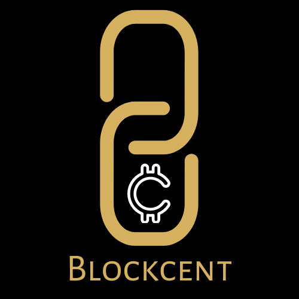

# Blockcent



Blockcent is an incentive programme for students to enable better enagement in
academic activities and have fun along the way!

Blockcent uses the [Hyperledger Fabric](https://github.com/hyperledger/fabric) blockchain for transparent and immutable book-keeping.

## Developers

* [Ujwal Kundur](https://github.com/Ajax-Light/) - Systems, Architecture, API, Hyperledger Fabric Blockchain

* [Aashutosh Konge](https://github.com/kaash-bot) - Frontend and UI

* [Sanjana S](https://github.com/sanjana87) - UI/UX

* [Atharva Gupta](https://github.com/AtharvaGupta01) - UI/UX

## Tech Stack

* React.js / Next.js

* Material-UI

* Express.js

* Node.js

* Hyperledger Fabric permissioned blockchain

* Docker and docker-compose

## Set-Up

### Installing Fabric

1. `cURL` the helper script mentioned in the [docs](https://hyperledger-fabric.readthedocs.io/en/latest/install.html) to the **same place** where Blockcent will be cloned to.
   This is very important as fabric and blockcent are configured to find each other only when they share the
   same parent folder.

   ``` bash

   curl -sSLO https://raw.githubusercontent.com/hyperledger/fabric/main/scripts/install-fabric.sh && chmod +x install-fabric.sh

   ```

2. Execute the install script `./install-fabric.sh` to install all fabric components, binaries and images.

3. `cd` into `fabric-samples/test-network`

4. Execute `./network.sh up -ca -verbose` to bring up the network. Optionally execute `./monitordocker.sh` to monitor the network.

5. Execute `./network.sh createChannel -c test` to create a channel named 'test' and join the peers to this channel

6. Execute `./network.sh deployCC -c test -ccn blockcent -ccl javascript -ccp ../../Blockcent/chaincode` to deploy the blockcent chaincode on the test channel.

### Setting up API and Frontend

1. Clone the Blockcent repo.

2. Run `npm install`

3. The API is available on `http://localhost:8090/api/`

4. The Frontend is available on `http://localhost:3000`

## Usage

1. Start the components in the following order:
    1. Start up Fabric and Deploy chaincode in a Channel

    2. Start API with `npm start`

    3. Start frontend with `npm run dev`

    4. **We also provide `npm run all` to start both API and Frontend parallelly**

2. Visit `http://localhost:3000`
